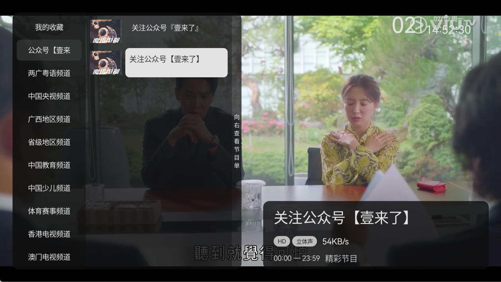
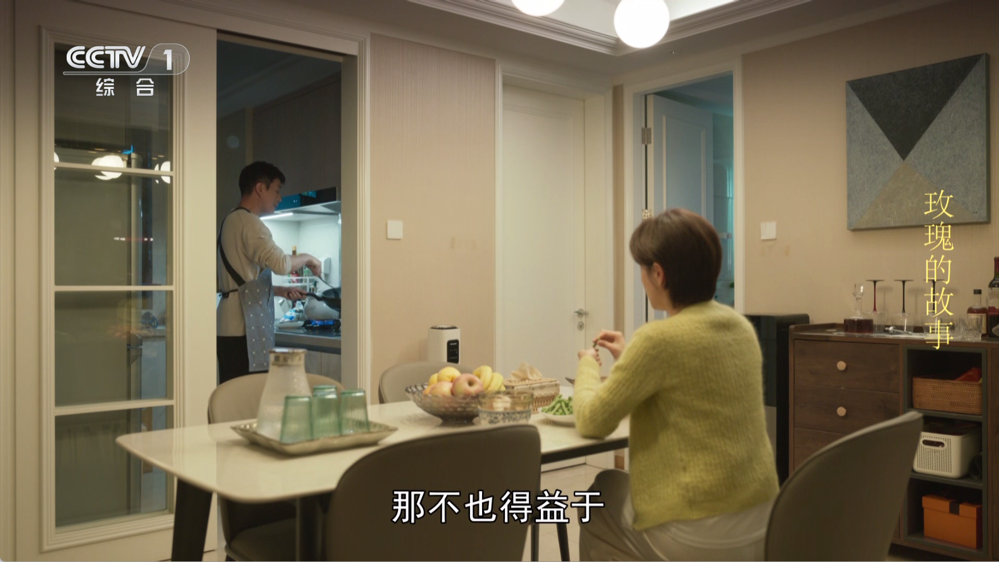
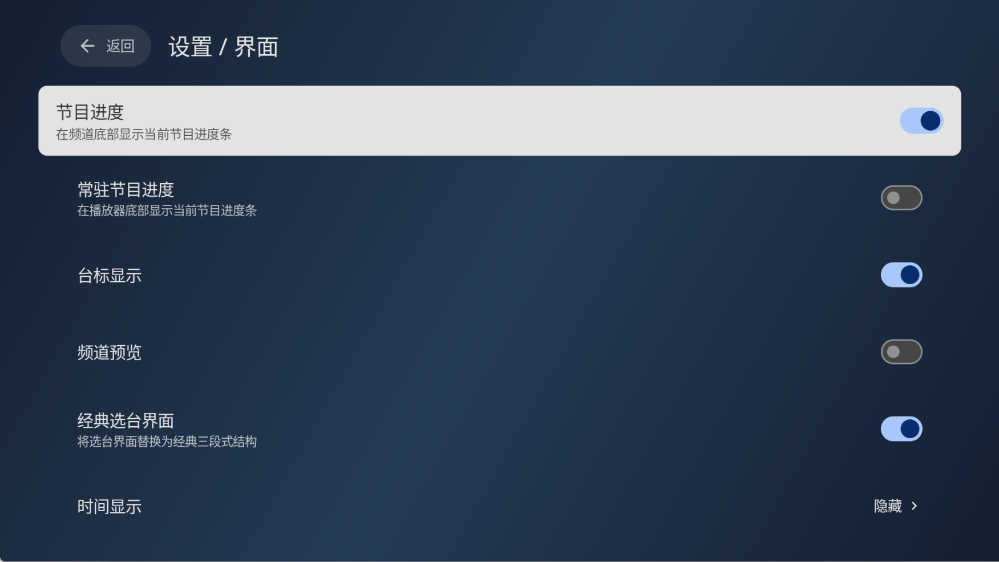

    <h1>壹来电视</h1>

## OneTV声明

### 各位朋友大家好

-1. 我不是一名程序员并且对代码一窍不通，本项目（壹来电视）中的所有代码、图片及文字内容都是基于前辈们的公开分享和贡献。
   这个项目的初衷是出于学习和个人兴趣。如果您发现本软件有任何侵占您利益的行为，请通过页面提供的联系方式与我联系，我会立即
   采取措施进行修正或删除。
-2. 本项目（壹来电视）是个人出于兴趣爱好，仅供学习和测试使用。项目中使用的所有API均来自官方渠道，并且不包含
   任何破解内容。请勿将本软件用于商业用途，并请您在下载后二十四小时内自行删除。
- 感谢您的理解与合作！
- 

 

## 更新日志

[更新日志](./CHANGELOG.md)

## 赞赏

## 致谢

- [mytv-android](https://github.com/jadehh/mytv-android)
- [my-tv](https://github.com/lizongying/my-tv)
- [参考设计稿](https://github.com/lizongying/my-tv/issues/594)
- [IPV6直播源](https://github.com/zhumeng11/IPTV)
- [live](https://github.com/fanmingming/live)
- 等等
